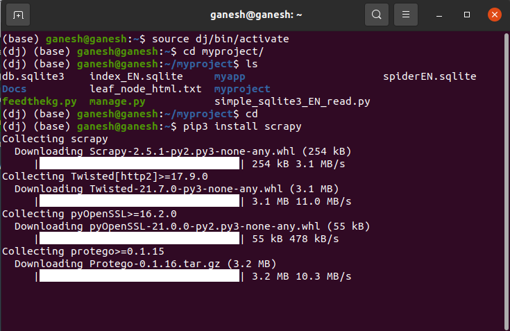
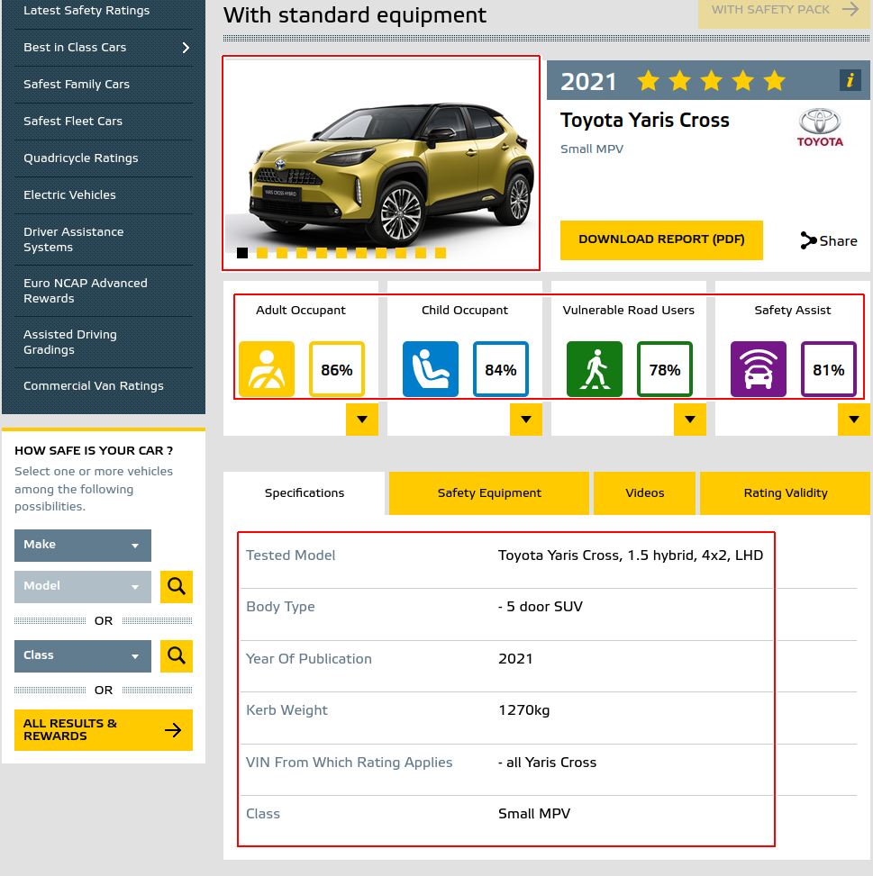

<!-- TABLE OF CONTENTS -->
<details>
  <summary>Table of Contents</summary>
  <ol>
    <li><a href="#overview">Overview</a></li>
    <li><a href="#requirements">Requirements</a></li>
    <li><a href="#installation">Installation</a></li>
    <li><a href="#documentation">Documentation</a></li>
    <li><a href="#companies-using-scrapy">Companies using Scrapy</a></li>
    
    
  </ol>
</details>


# Scrapy


.. image:: https://img.shields.io/pypi/v/Scrapy.svg
   :target: https://pypi.python.org/pypi/Scrapy
   :alt: PyPI Version

.. image:: https://img.shields.io/pypi/pyversions/Scrapy.svg
   :target: https://pypi.python.org/pypi/Scrapy
   :alt: Supported Python Versions

.. image:: https://img.shields.io/travis/scrapy/scrapy/master.svg
   :target: https://travis-ci.org/scrapy/scrapy
   :alt: Build Status

.. image:: https://img.shields.io/badge/wheel-yes-brightgreen.svg
   :target: https://pypi.python.org/pypi/Scrapy
   :alt: Wheel Status

.. image:: https://img.shields.io/codecov/c/github/scrapy/scrapy/master.svg
   :target: https://codecov.io/github/scrapy/scrapy?branch=master
   :alt: Coverage report

.. image:: https://anaconda.org/conda-forge/scrapy/badges/version.svg
   :target: https://anaconda.org/conda-forge/scrapy
   :alt: Conda Version

<!-- Overview -->
# Overview


Scrapy is a fast high-level web crawling and web scraping framework, used to
crawl websites and extract structured data from their pages. It can be used for
a wide range of purposes, from data mining to monitoring and automated testing.
It s a fully fledged solution which allows people to write small amounts of Python code to create a “spider” - an automated bot which can trawl web pages and scrape them.
Scrapy provides built-in support for selecting and extracting data from HTML/XML sources using extended CSS selectors and XPath expressions. Combining the both methods gives a powerful webscrapping on the content. Built-in support for generating feed exports in multiple formats (JSON, CSV, XML) and storing them in multiple backends (FTP, S3, local filesystem)

Check the Scrapy homepage at https://scrapy.org for more information,
including a list of features.

<p align="right">(<a href="#top">back to top</a>)</p>

<!-- Requirements -->
# Requirements


* Python 3.6+
* Works on Linux, Windows, macOS, BSD

<p align="right">(<a href="#top">back to top</a>)</p>

<!-- Installation -->
# Installation


The quick way

   ```
   python3 -m venv env
   source env/bin/activate
   ```    

See the install section in the documentation at
https://docs.scrapy.org/en/latest/intro/install.html for more details.

The proper way

1. Its better to create a virtual environment before installing Scrapy.

2. Create the virtual environment with the following command 

  ```
   pip install scrapy
   
   ``` 
   
3. Virtual environment env is created and activated, now install Scrapy 

 ```
   pip install scrapy
   
   ``` 

4. Now to create a scrapy project enter the following command, Euroncap is the project name which is changeable based on the project

 ```
   scrapy startproject Euroncap
   
   ``` 
   
5. Navigate to spiders subfolder and create a file such as euroncap\_spider.py

 ```
   cd Euroncap/spiders
   gedit euroncap_spider.py
   
   ``` 
6. After the file has been opened copy the following code

    ```python
    import scrapy

    class EuroncapSpider(scrapy.Spider):

	# Spider name
	name = "Euroncap"

	# Extracting from local file
	# start_urls = ["file:///home/ganesh/ \
	              scrapy_learning/leaf_node_html.html"]

	# Extracting from website
	start_urls = ["https://www.euroncap.com/ \
	              en/results/toyota/yaris-cross/43819"]

	

	# Parse functon to extract the features needed
	def parse(self, response):

		# Extracting images from desired location
		# having data and data-src as per 
		# the outline of the page

		# raw_image_urls_data = response.xpath('//*\
		                    [@class="reward-images"] \ 
		                    //img/@data-src').getall()
		# raw_image_urls = response.xpath('//* \ 
		                    [@class="reward-images"] \ 
		                    //img/@src').getall()

	
		# Extracting all possible images from the links
		raw_image_urls_data = response.xpath('//img \ 
		                          /@data-src').getall()
		raw_image_urls = response.xpath('//img/ \ 
		                          @src').getall()


		clean_image_urls = []
		for img_url in raw_image_urls_data:
			clean_image_urls.append(response.urljoin(img_url))

		for img_url in raw_image_urls:
			clean_image_urls.append(response.urljoin(img_url))

		
		#Concentrating only table
		specification_table = response.css("div.tab_container")
		
		col1_data = [specs.css("span.tcol1::text").getall()\
		               for specs in specification_table]
		col2_data = [specs.css("span.tcol2::text").getall()\ 
		               for specs in specification_table]

		
		yield {

               'rating-title' : response.xpath('//div \ 
                                  [@class="rating-title"]\ 
                                  /p/text()').getall(),
			   
               'col1' : col1_data,
               'col2' : col2_data,
               'value'        : response.css('div.value\ 
			                       ::text').getall(),
               'image_urls' : clean_image_urls

		}
			# print("done")
    ```

7. Once the code is copied, save the file.
8. Now open the settings.py file and include the following lines below the BOT_NAME definition

 ```
    cd ..
    gedit settings.py
   
   ``` 
   
       ```python
       ITEM_PIPELINES = {'scrapy.pipelines.images.ImagesPipeline': 1}

	# Storage folder

	IMAGES_STORE = 'Extracted_images'
    
    ```

9. Now we have written a code to scrape all images from the  following webpage  \href{https://www.euroncap.com/en/results/toyota/yaris-cross/43819}{"https://www.euroncap.com/en/results/toyota/yaris-cross/43819"} to Extracted\_images folder under Euroncap subfolder. Along with this the specfication is also scraped and stored in the variables define under yield in the code. This can be saved in json file too.

10. Now to run the spider enter the following command, Euroncap is the bot name that is provide in the code file for the "name" variable

 ```
   scrapy crawl Euroncap 
   
   ``` 
   
11. Inorder to store the output in json file enter the following command

 ```
   scrapy crawl Euroncap -o euroncap.json 
   
   ```
   
12. The same procedures can be done for a html file instead of a webpage since the structures are similar.

<p align="right">(<a href="#top">back to top</a>)</p>

<!-- Documentation -->
# Documentation


Documentation is available online at https://docs.scrapy.org/ and in the ``docs``
directory.

<p align="right">(<a href="#top">back to top</a>)</p>

<!-- Releases -->
# Releases


You can check https://docs.scrapy.org/en/latest/news.html for the release notes.

<p align="right">(<a href="#top">back to top</a>)</p>


<!-- Companies using Scrapy -->
# Companies using Scrapy

See https://scrapy.org/companies/ for a list.

<p align="right">(<a href="#top">back to top</a>)</p>
